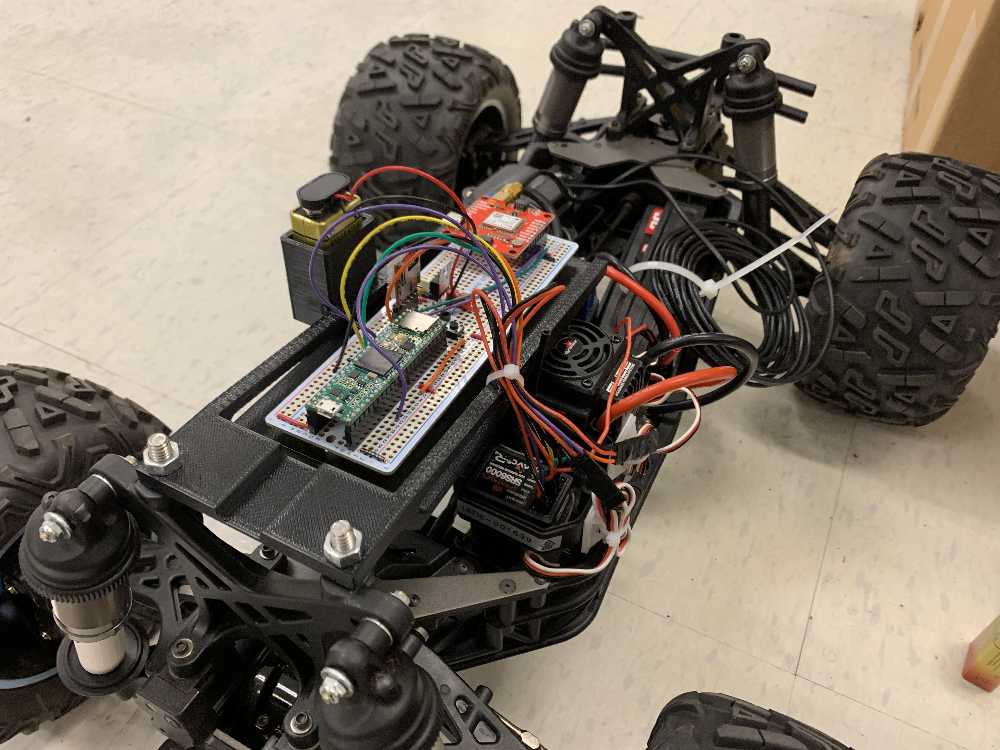

## Description
I modified a R/C car to have a cruise control system and log critical data. The overall goal of the research project is to land an autonomous quadcopter on a moving dock. The truck pictured below will have the landing dock mounted ontop. This cruise control system has a few modes: a "pass through" mode where the truck can be controlled normally, a mode in which the cruise control setpoint can be wirelessly changed, and a cruise control mode where a constant PWM width is passed into the ESC from the onboard computer. GPS data is logged onto a micro SD card for further analysis after the test runs. By using this system, the truck does not need to be driven during testing, and a constant velocity can be used for testing. This makes it easier to debug and run tests with the system.

## Additional Info

**Location**: AREAL Lab, Georgia Tech

**Dates**: January 2021 - March 2021