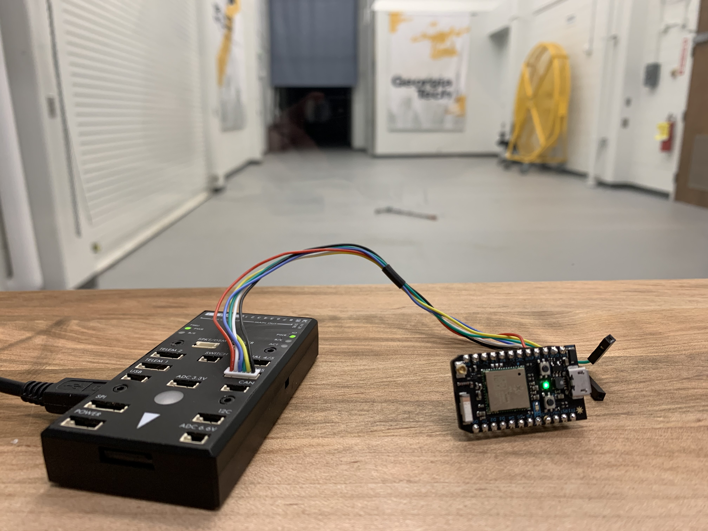

## Description 
I designed and tested a tool that takes in VICON motion caputre data and converts it to an equivalent stream of data formatted as a GPS. Using this tool, any flight controller that would expect GPS data can be used in the Indoor Flight Lab (IFL) at Georgia Tech with no modifications. The tool can be easily customized to fit anyone's needs. Additional noise can be artifically added to the VICON data to better emulate GPS data. The rate at which the data is output and the format of the data (NMEA and UBX) can also be chosen.

## Additional Info
**Location**:  AREAL and Indoor Flight Lab (IFL), Georgia Tech

**Dates**: January 2020 - January 2021